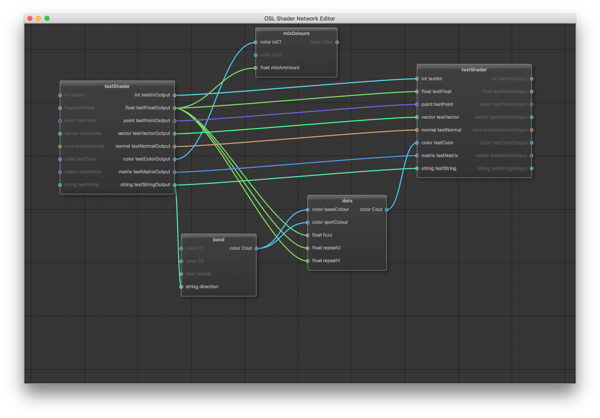

# OSLNetwork Editor(Work In Progress)

This tool will read in compiled OSL shaders and export OSL XML network files, at present the compiled shaders can be read and created into nodes which can be connected together. 

## Dependencies

The node system is based on [Qt5 Node Editor. Dataflow programming framework](https://github.com/paceholder/nodeeditor) I may add this into the source tree eventually.

You will also need Qt 5 and renderman installed with the OSL tools, to parse the shaders I use the output of oslinfo (may eventually add support to read the shaders directly)

